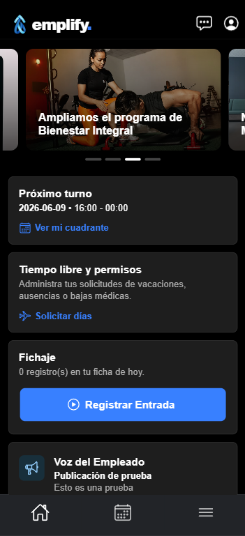

# Emplify - Guía de Inicio


📱 Vista Previa de la Aplicación

<p align="center">
  <a href="https://emplify-jade.vercel.app/inicio" target="_blank">
    
  </a>
</p>

Bienvenido a la guía de inicio rápido de **Emplify**. Sigue estos pasos para instalar los requisitos previos, configurar MySQL, arrancar el backend (Spring Boot) y el frontend (Ionic), e iniciar sesión por primera vez.

> Al finalizar esta guía, tendrás el backend de Emplify ejecutándose en el puerto `8080` y el frontend en el puerto `8100`, con una sesión activa y funcional en tu navegador.

---

## 📋 Requisitos Previos

Antes de comenzar, asegúrate de tener instaladas las siguientes herramientas en tu equipo:

| Herramienta | Versión Mínima | Propósito |
| :--- | :--- | :--- |
| **Java** | 21 | Ejecutar el backend construido en Spring Boot. |
| **Maven** | *Incluido (`mvnw`)* | Compilar y ejecutar el backend. |
| **Node.js** | 18 LTS o superior | Ejecutar el frontend desarrollado en Ionic/Angular. |
| **MySQL** | 8.0 o superior | Sistema de gestión de bases de datos relacional. |

*💡 **Nota:** El repositorio incluye el wrapper de Maven (`mvnw`), por lo que no es necesario instalar Maven por separado. Se requiere Java 21 ya que el archivo `pom.xml` declara `<java.version>21</java.version>`.*

---

## ⚙️ Instalación y Configuración

### 1️⃣ Clonar el repositorio
Clona el monorepositorio de Emplify y navega hacia su carpeta:

```bash
git clone https://github.com/Sufianeh7/Emplify.git
cd Emplify
```

### 2️⃣ Preparar la base de datos MySQL

La URL de conexión del backend incluye el parámetro `createDatabaseIfNotExist=true`, lo que significa que Hibernate creará el esquema `emplify_db` automáticamente la primera vez que arranques. 

Solo necesitas tener el servidor MySQL en ejecución y un usuario con los privilegios adecuados.

Si utilizas la cuenta por defecto `root` sin contraseña (como viene en la configuración base), conéctate a MySQL y asegúrate de otorgar los accesos:

```
-- Ejecuta esto solo si tu usuario root requiere una concesión de contraseña
ALTER USER 'root'@'localhost' IDENTIFIED BY '';
FLUSH PRIVILEGES;
```

(Si usas un usuario/contraseña diferente, actualiza el archivo `application.properties` en el paso 3).

### 3️⃣ Configurar el backend

Abre el archivo de configuración en Back/backend/src/main/resources/application.properties y confirma o actualiza los credenciales de MySQL:

```
spring.application.name=emplify-backend

# --- CONFIGURACION DE BASE DE DATOS ---
spring.datasource.url=${SPRING_DATASOURCE_URL:jdbc:mysql://localhost:3306/emplify_db?createDatabaseIfNotExist=true&serverTimezone=UTC}
spring.datasource.username=${SPRING_DATASOURCE_USERNAME:root}
spring.datasource.password=${SPRING_DATASOURCE_PASSWORD:}

# --- CONFIGURACION JPA / HIBERNATE ---
spring.jpa.hibernate.ddl-auto=update
spring.jpa.show-sql=true
spring.jpa.database-platform=org.hibernate.dialect.MySQLDialect

# --- CONFIGURACION DE SERIALIZACION ---
spring.jackson.serialization.fail-on-empty-beans=false
```

💡 Consejo: Los campos clave a modificar son `spring.datasource.username` y `spring.datasource.password` si tu configuración de MySQL es distinta a la de por defecto.

### 4️⃣ Iniciar el backend (Spring Boot)

Desde el directorio Back/backend/, ejecuta el wrapper de Maven:

**Para macOS / Linux / Windows (Git Bash):**

```
cd Back/backend
./mvnw spring-boot:run
```

Spring Boot arrancará en el **puerto 8080**. Sabrás que está listo cuando veas una línea parecida a esta en la consola, lo que confirma que el servidor está listo:

```
Started BackendApplication in X.XXX seconds
```

En la primera ejecución, Hibernate procesará `ddl-auto=update` y creará todas las tablas en `emplify_db`.

### 5️⃣ Instalar dependencias del frontend

Abre una nueva terminal, ve al directorio del frontend e instala los paquetes de Node:

```
cd Front/emplify-app
npm install
```

### 6️⃣ Iniciar el frontend (Ionic/Angular)

Inicia el servidor de desarrollo utilizando el script de inicio (el cual ejecuta `ng serve` por debajo):

```
npm start
```

El frontend se servirá en el **puerto 8100**. La consola de Angular te mostrará una URL como esta:

```
Local: http://localhost:8100/
```

### 7️⃣ Primer Inicio de Sesión

Abre http://localhost:8100 en tu navegador. Verás la pantalla de inicio de sesión de Emplify.

Ingresa el correo y la contraseña de un usuario existente. La aplicación codifica las credenciales como un encabezado `Base64 Authorization: Basic` y llama a `GET /api/empleados/perfil` para verificarlas. Si es exitoso, tu token de sesión se guarda en `localStorage` y serás redirigido al panel de tu rol.

* **Nota:** No hay un flujo de auto-registro. El primer usuario ADMIN debe insertarse directamente en la tabla `usuario` con una contraseña hasheada en BCrypt, o ser creado a través del endpoint `POST /api/admin/alta-empleado` una vez que tengas una credencial ADMIN existente. *
  
Para generar un hash BCrypt para una contraseña inicial, puedes usar cualquier herramienta online de BCrypt o descomentar temporalmente el bloque de generación de hash en `BackendApplication.java`:

```
JavaBCryptPasswordEncoder encoder = new BCryptPasswordEncoder();
String miHash = encoder.encode("tu-contraseña");
System.out.println("Hash: " + miHash);
```

Luego inserta una fila en la tabla `usuario`:

```
INSERT INTO usuario (nombre, email, password, rol, activo)
VALUES ('Admin', 'admin@ejemplo.com', '$2a$10$...pega-tu-hash-aqui...', 'ADMIN', 1);
```

En la tabla `empresa`:

```
INSERT INTO empresa (nombre, sector, direccion)
VALUES ('Emplify', 'Tecnología', 'Calle Direccion 123')
```

En la tabla `empleado`:

```
INSERT INTO empleado (id_empresa, id_usuario, id_manager, asuntos_propios_disponibles, vacaciones_disponibles, departamento, puesto)
VALUES (1, 1, 1, 3, 22, 'IT', 'Administrador del sistema')
```

En la tabla `tipo_solicitud`:

```
INSERT INTO tipo_solicitud (dias_anuales, nombre)
VALUES (22, 'VACACIONES'), (3, 'ASUNTOS PROPIOS'), (null, 'BAJA MÉDICA')
```

### 🖥️ ¿Qué se está ejecutando?

Una vez que ambos procesos estén levantados, tendrás acceso a los siguientes servicios locales:

| Servicio | URL | LocalNotas |
| :--- | :--- | :--- |
| **Spring Boot API** | `http://localhost:8080` | Endpoints REST bajo la ruta `/api/` | 
| **WebSocket Endpoint** | `http://localhost:8080/ws-endpoint` | STOMP sobre protocolo SockJS |
| **Frontend Ionic** | `http://localhost:8100` | Servidor de desarrollo Angular |
